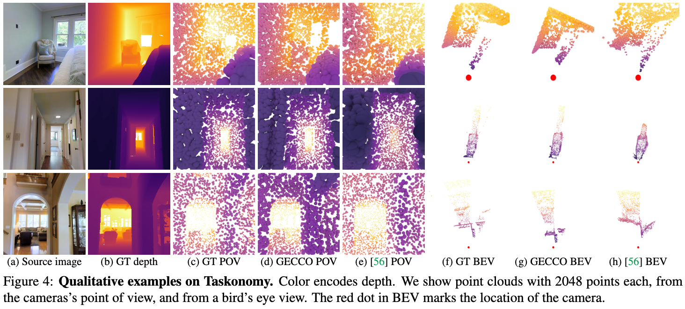

> Diffusion models generating images conditionally on text, such as Dall-E 2 and Stable Diffusion, have recently made a splash far beyond the computer vision community. Here, we tackle the related problem of generating point clouds, both unconditionally, and conditionally with images. For the latter, we introduce a novel geometrically-motivated conditioning scheme based on projecting sparse image features into the point cloud and attaching them to each individual point, at every step in the denoising process. This approach improves geometric consistency and yields greater fidelity than current methods relying on unstructured, global latent codes. Additionally, we show how to apply recent continuous-time diffusion schemes. Our method performs on par or above the state of art on conditional and unconditional experiments on synthetic data, while being faster, lighter, and delivering tractable likelihoods. We show it can also scale to diverse indoors scenes.