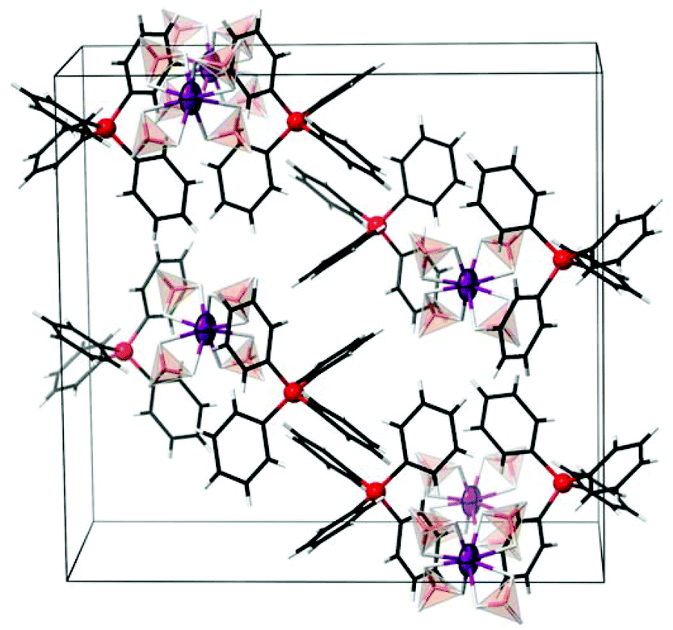

> We report the most recent results related to application of a metathetic pathway towards mixed-metal borohydrides. The synthetic protocol utilizes highly-fluorinated weakly coordinating anion salts as precursors. We discuss the technicalities related to the use of fluorine-rich anions as well as the improvements which are still needed to deliver high-purity materials with potential applications for hydrogen storage. The applicability of the method is expanded beyond the previously described complex borohydrides of alkali metal Zn or Y, towards the systems containing MgII, ScIII, MnII, or EuIII. We have prepared for the first time [Ph4P]2[Mn(BH4)4] and [Me4N]2[Mg(BH4)4], solved their crystal structures from powder x-ray diffraction, and used selected organic metal borohydride derivatives as precursors towards mixed-metal borohydrides (K2Mn(BH4)4, Rb3Mg(BH4)5, etc.). We have also prepared [Ph4P][Eu(BH4)4], which is the first derivative of EuIII in the homoleptic environment of borohydride anions.