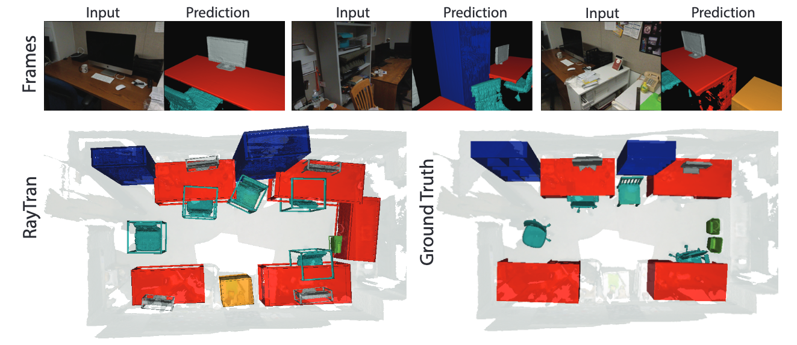

> We propose a transformer-based neural network architecture for multi-object 3D reconstruction from RGB videos. It relies on two alternative ways to represent its knowledge: as a global 3D grid of features and an array of view-specific 2D grids. We progressively exchange information between the two with a dedicated bidirectional attention mechanism. We exploit knowledge about the image formation process to significantly sparsify the attention weight matrix, making our architecture feasible on current hardware, both in terms of memory and computation. We attach a DETR-style head on top of the 3D feature grid in order to detect the objects in the scene and to predict their 3D pose and 3D shape. Compared to previous methods, our architecture is single stage, end-to-end trainable, and it can reason holistically about a scene from multiple video frames without needing a brittle tracking step. We evaluate our method on the challenging Scan2CAD dataset, where we outperform (1) recent state-of-the-art methods for 3D object pose estimation from RGB videos; and (2) a strong alternative method combining Multi-view Stereo with RGB-D CAD alignment.