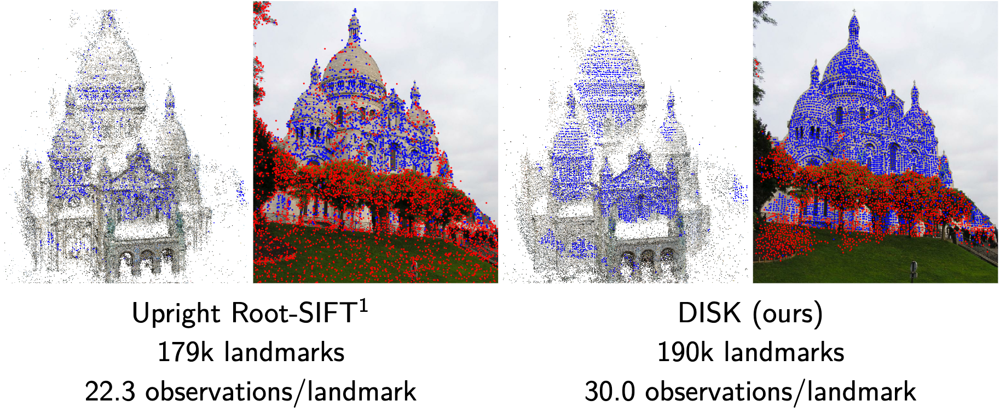

> Local feature frameworks are difficult to learn in an end-to-end fashion due to the discreteness inherent to the selection and matching of sparse keypoints. We introduce DISK (DIScrete Keypoints), a novel method that overcomes these obstacles by leveraging principles from Reinforcement Learning (RL), optimizing end-to-end for a high number of correct feature matches. Our simple yet expressive probabilistic model lets us keep the training and inference regimes close, while maintaining good enough convergence properties to reliably train from scratch. Our features can be extracted very densely while remaining discriminative, challenging commonly held assumptions about what constitutes a good keypoint, as showcased in Fig. 1, and deliver state-of-the-art results on three public benchmarks.